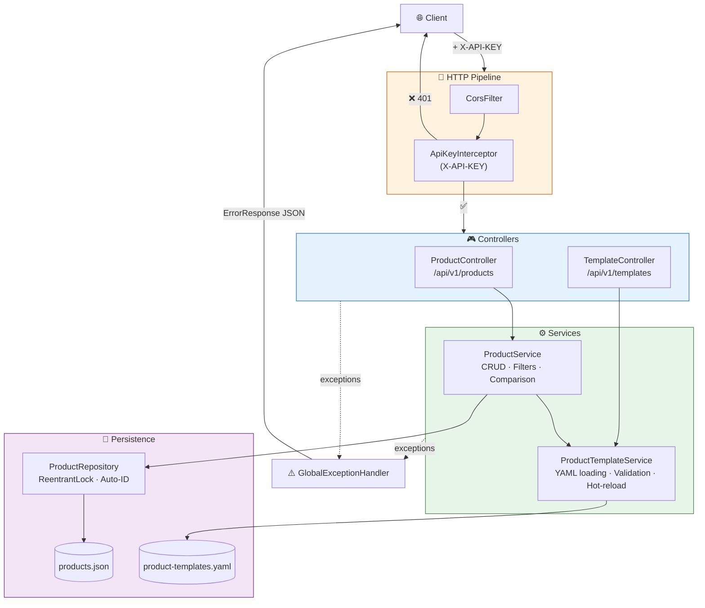
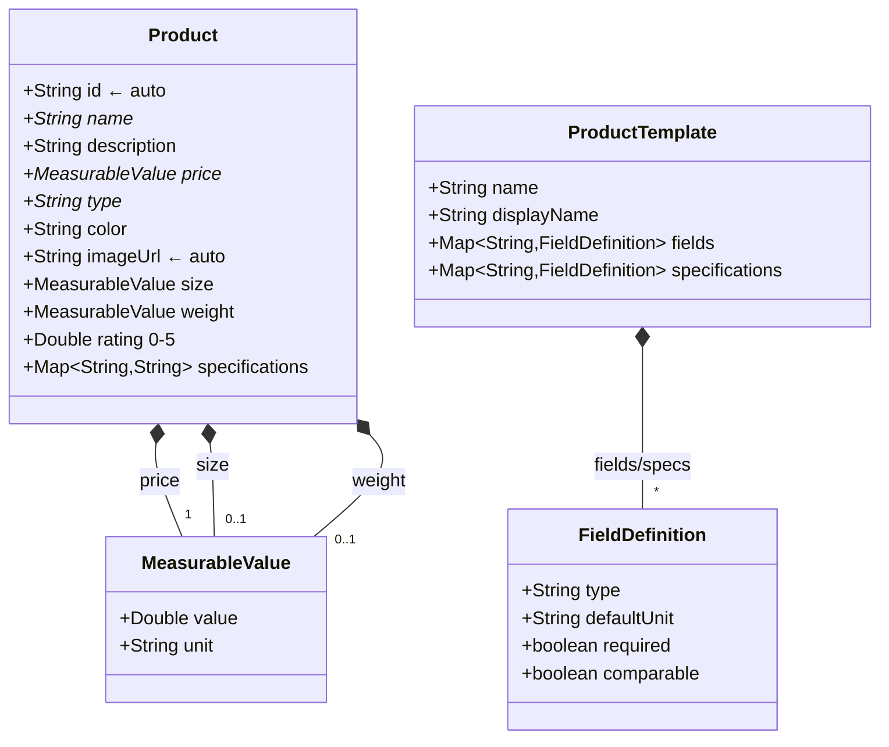
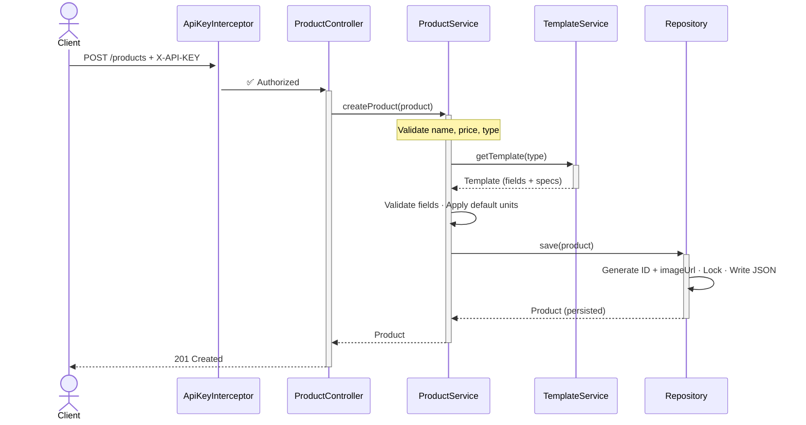
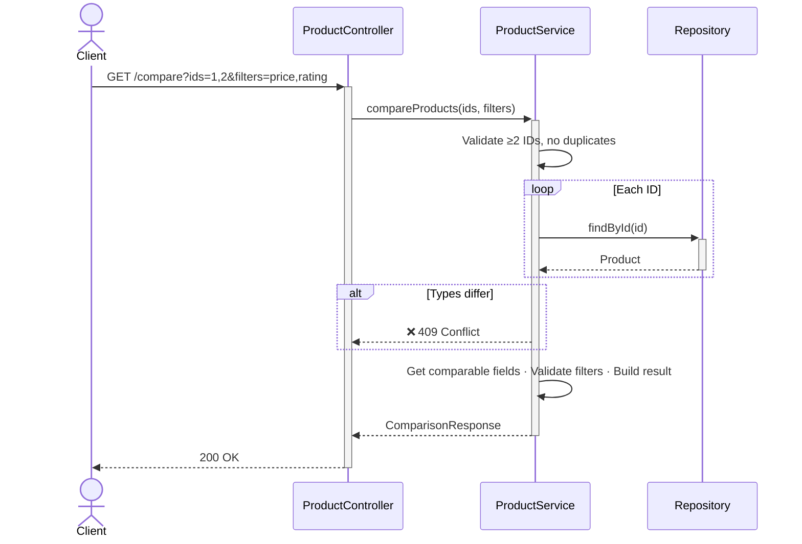
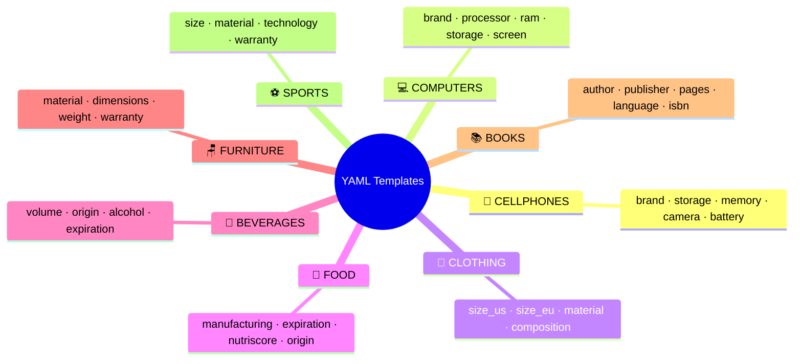

# 📊 Product API — Architecture & Flow Diagrams

> Spring Boot 3.2.0 REST API for product management and comparison. Java 17, Maven, JSON file persistence, YAML-driven product templates.

---

## 🔄 Request Flow & Architecture



---

## 📡 Endpoints

| Method | Path | Description | Status |
|--------|------|-------------|--------|
| `GET` | `/api/v1/products` | List/search + filters + pagination | `200` |
| `GET` | `/api/v1/products/{id}` | Get by ID | `200` / `404` |
| `POST` | `/api/v1/products` | Create product | `201` |
| `PUT` | `/api/v1/products/{id}` | Update product | `200` / `404` |
| `DELETE` | `/api/v1/products/{id}` | Delete product | `204` / `404` |
| `GET` | `/api/v1/products/stats/count` | Total count | `200` |
| `GET` | `/api/v1/products/compare` | Compare by IDs (same type) | `200` / `409` |
| `GET` | `/api/v1/templates` | List all templates | `200` |
| `GET` | `/api/v1/templates/{type}` | Get template by type | `200` / `404` |
| `POST` | `/api/v1/templates/reload` | Hot-reload YAML | `200` |

**Filters** (`GET /products`): `name`, `description` (partial), `type` (exact), `priceMin`/`priceMax`, `page`/`pageSize`, `specFilters`.

---

## 📦 Domain Model



**Supporting DTOs:** `ProductFilter` (query params + validation), `PageResponse<T>` (paginated results), `ProductComparisonResponse` (comparison output), `ErrorResponse` (structured errors).

---

## 🔄 Create Product Flow



---

## 🔍 Comparison Flow



---

## 🗂️ Product Types



---

## ⚠️ Error Handling

All errors routed through `GlobalExceptionHandler` → structured `ErrorResponse`:

| Exception | HTTP Status |
|-----------|-------------|
| `IllegalArgumentException` / `MethodArgumentNotValidException` / `ConstraintViolationException` / `TypeMismatchException` | **400** Bad Request |
| `ProductNotFoundException` | **404** Not Found |
| `IncompatibleProductTypesException` | **409** Conflict |
| `Exception` (catch-all) | **500** Internal Server Error |

```json
{ "timestamp": "...", "status": 400, "error": "Bad Request", "message": "...", "path": "/api/v1/products" }
```

---

> 📌 Diagrams use [Mermaid](https://mermaid.js.org/) — renders on GitHub, GitLab, and VS Code.
